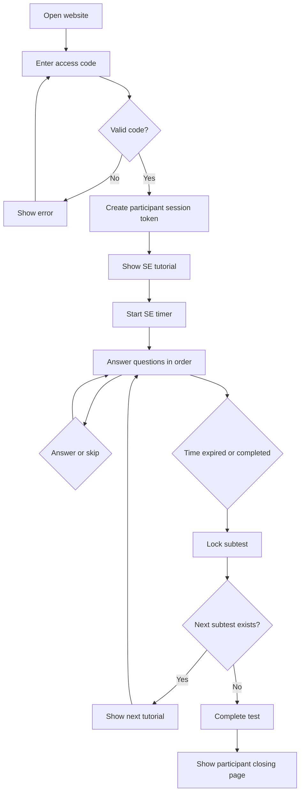

# Development Brief - Production Website IST Assessment

## 1. Project Summary

Bangun website produksi untuk pelaksanaan, skoring, pelaporan, dan pengelolaan Intelligenz Struktur Test (IST) yang digunakan perusahaan.

Website memiliki dua sisi utama:

1. **Participant Application** - peserta masuk menggunakan kode unik, melihat tutorial, dan mengerjakan sembilan subtes secara berurutan.
2. **HR/Admin Application** - HR membuat peserta dan sesi, menghasilkan kode, memantau pengerjaan, memberi skor GE, serta melihat hasil dan grafik.

Prototype UI sudah selesai dan menjadi baseline pengalaman pengguna. Tahap aktif sekarang adalah **production development**: mengganti seluruh simulasi dengan database, autentikasi, session engine, scoring engine, norma usia tervalidasi, laporan, keamanan, audit trail, deployment, dan prosedur operasional.

Dokumen ini mencakup perjalanan pengembangan sampai aplikasi dinyatakan siap digunakan perusahaan, bukan hanya sampai demonstrasi UI.

---

## 2. Product Goals

- Peserta tidak perlu membuat akun.
- HR membuat sesi dan sistem menghasilkan kode akses unik.
- Kode langsung aktif tanpa menunggu approval.
- Peserta mengerjakan subtes dan soal sesuai urutan.
- Peserta dapat menjawab atau melewati soal.
- Peserta dapat kembali ke soal yang dilewati selama subtes masih aktif.
- Setiap subtes memiliki tutorial teks, video, atau kombinasi keduanya.
- Timer berjalan per subtes dan dikontrol server.
- Saat waktu habis, subtes ditutup dan peserta diarahkan ke tutorial berikutnya.
- Sistem menghitung skor menggunakan kunci dan norma berdasarkan usia peserta.
- HR/Admin melihat RW, SW/WS, IQ, kategori, profil, dan grafik.
- Peserta tidak melihat hasil internal HR.
- Sistem tidak membuat keputusan otomatis menerima atau menolak kandidat.

---

## 3. Users and Roles

### Participant

- Masuk menggunakan kode akses.
- Melihat tutorial.
- Memulai subtes.
- Menjawab atau melewati soal.
- Melihat progres dan sisa waktu.
- Kembali ke soal skipped selama subtes aktif.
- Menyelesaikan tes.
- Tidak melihat kunci, norma, atau hasil.

### HR Admin

- Login ke dashboard.
- Membuat peserta.
- Membuat sesi dan kode akses.
- Membatalkan atau membuat ulang kode.
- Memantau progres peserta.
- Melihat answered, skipped, dan unanswered.
- Membuat, mengubah, melihat pratinjau, dan memublikasikan tutorial teks/video per subtes.
- Mengaktifkan versi tutorial baru tanpa mengubah tutorial pada sesi yang sedang berjalan.
- Membuat draft versi subtes, menambahkan soal, dan memperbarui konten soal sesuai permission.
- Melihat pratinjau dan mengajukan versi bank soal untuk dipublikasikan.
- Memberi skor GE menggunakan rubrik 0/1/2.
- Menghitung dan melihat hasil.
- Melihat grafik sembilan subtes.
- Mengunduh laporan final.

### Super Admin

- Mengelola akun HR.
- Mengatur konfigurasi teknis.
- Mengelola tutorial lintas organisasi atau membantu HR Admin sesuai permission.
- Mengelola versi subtes dan bank soal lintas organisasi sesuai permission.
- Mengelola master data melalui workflow terbatas.
- Melihat hasil hanya jika memiliki permission `view_results`.
- Melihat audit log.

---

## 4. IST Structure

|  No | Subtest |   Items | Count |   Duration |
| --: | ------- | ------: | ----: | ---------: |
|   1 | SE      |    1-20 |    20 |  6 minutes |
|   2 | WA      |   21-40 |    20 |  6 minutes |
|   3 | AN      |   41-60 |    20 |  7 minutes |
|   4 | GE      |   61-76 |    16 |  8 minutes |
|   5 | RA      |   77-96 |    20 | 10 minutes |
|   6 | ZR      |  97-116 |    20 | 10 minutes |
|   7 | FA      | 117-136 |    20 |  7 minutes |
|   8 | WU      | 137-156 |    20 |  9 minutes |
|   9 | ME      | 157-176 |    20 |  9 minutes |

Total: 176 items and 72 minutes of working time.

Fixed order:

`SE -> WA -> AN -> GE -> RA -> ZR -> FA -> WU -> ME`

---

## 5. Technology Stack

### Baseline UI yang sudah tersedia

- Next.js App Router
- React
- TypeScript
- Tailwind CSS and reusable CSS components
- React state with mock data
- npm
- Node test/build validation

### Stack produksi

- Next.js + React + TypeScript
- Vercel untuk hosting Next.js, deployment preview, staging, dan production
- Next.js Route Handlers/server actions untuk business logic dan API
- Drizzle ORM
- Supabase PostgreSQL sebagai database awal
- Supabase Auth untuk HR/Admin dengan server-side session; SSO/OIDC perusahaan dapat ditambahkan kemudian
- Supabase Storage private bucket untuk video, gambar, dan laporan
- Hashed access code and opaque participant session token
- Server-generated PDF
- Structured logging, error monitoring, and append-only audit trail

### Architecture Principles

- Use a modular monolith for MVP.
- Separate UI, session engine, scoring engine, norm engine, and data access.
- Keep scoring keys and norms on the server.
- Do not use Excel as the production scoring engine.
- Use versioned forms, tutorials, keys, formulas, and norms.
- Do not implement microservices unless operational requirements justify them.

### Deployment awal dan portabilitas

Arsitektur awal:

```text
Browser
  -> Vercel / Next.js
       -> Supabase Auth
       -> Supabase PostgreSQL
       -> Supabase Storage (private)
```

Aturan agar aplikasi dapat dipindahkan ke server kantor:

- Business logic tes, timer, skoring, norma, dan laporan berada di modul Next.js/server, bukan di Supabase Edge Functions.
- Akses database melalui Drizzle dan SQL PostgreSQL standar; hindari ketergantungan inti pada API database khusus Supabase.
- File diakses melalui `StorageProvider` agar Supabase Storage dapat diganti dengan S3-compatible storage atau object storage kantor.
- Autentikasi dibungkus pada `AuthProvider` agar Supabase Auth dapat diganti atau dihubungkan ke OIDC/SSO perusahaan.
- Semua konfigurasi menggunakan environment variables; tidak ada URL, project ID, atau secret Supabase/Vercel yang ditanam di source code.
- Next.js harus tetap dapat dijalankan sebagai Node.js server atau Docker container di belakang reverse proxy pada server kantor.
- Database migration tetap dikelola dari repository dan dapat dijalankan terhadap PostgreSQL Supabase maupun PostgreSQL kantor.

Target migrasi server kantor:

```text
Browser
  -> Reverse proxy perusahaan
       -> Next.js Node.js/Docker
            -> PostgreSQL perusahaan
            -> S3-compatible/private file storage
            -> OIDC/SSO perusahaan
```

Migrasi hosting tidak boleh mengubah aturan bisnis, struktur hasil, calculation snapshot, atau audit trail.

---

## 6. Application Routes

### Route baseline yang sudah tersedia

| Route            | Purpose                   |
| ---------------- | ------------------------- |
| `/`              | Participant code entry    |
| `/test/tutorial` | Subtest tutorial          |
| `/test/session`  | Question and timer screen |
| `/test/complete` | Completion screen         |
| `/hr`            | HR/Admin dashboard        |

### Production Participant Routes

| Route                                     | Purpose                   |
| ----------------------------------------- | ------------------------- |
| `/test`                                   | Code entry                |
| `/test/[token]/tutorial/[subtest]`        | Active subtest tutorial   |
| `/test/[token]/question/[subtest]/[item]` | Active question           |
| `/test/[token]/review/[subtest]`          | Skipped/unanswered review |
| `/test/[token]/transition`                | Subtest transition        |
| `/test/[token]/complete`                  | Final participant page    |

### Production HR/Admin Routes

| Route                  | Purpose                          |
| ---------------------- | -------------------------------- |
| `/hr`                  | Dashboard                        |
| `/hr/participants`     | Participant list                 |
| `/hr/participants/new` | Create participant               |
| `/hr/sessions`         | Session list                     |
| `/hr/sessions/new`     | Create session and access code   |
| `/hr/sessions/[id]`    | Session detail and progress      |
| `/hr/scoring/[id]/ge`  | GE scoring                       |
| `/hr/results/[id]`     | Result and chart                 |
| `/hr/reports/[id]`     | Report preview/download          |
| `/hr/tutorials`        | Tutorial list and versioning     |
| `/hr/tutorials/[id]`   | Edit, preview, and publish       |
| `/hr/question-bank`    | Subtest versions and item editor |
| `/admin/users`         | User management                  |
| `/admin/tutorials`     | Global tutorial management       |
| `/admin/question-bank` | Global question management       |
| `/admin/audit`         | Audit log                        |

---

## 7. Participant Flow



---

## 8. Access Code Requirements

Example:

`IST-7K4M9Q2D`

Rules:

- One code belongs to one assessment session.
- The code is active immediately after HR creates the session.
- Participant does not need an account.
- Code has an expiration time.
- HR can revoke or regenerate the code.
- Regeneration invalidates the old code.
- Completed code cannot start another test.
- One code cannot create two active attempts.
- After initial validation, use an opaque session token.
- Store only the code hash in production.
- Rate-limit invalid attempts.
- Never write the complete code to general logs.

Code states:

- `active`
- `in_use`
- `completed`
- `expired`
- `revoked`
- `regenerated`

---

## 9. Tutorial Requirements

Each subtest can use:

- text;
- video;
- text and video;
- example image;
- non-scored example item.

Tutorial displays:

- subtest code and name;
- item count;
- duration;
- instructions;
- example;
- skip rule;
- `Timer belum dimulai` status;
- `Mulai Subtes` button.

Rules:

- Tutorial time is not part of the subtest duration.
- Video buffering does not reduce subtest time.
- Server starts the timer after receiving `start_subtest`.
- Tutorial content is versioned.
- Running sessions keep the tutorial version assigned at session creation.
- HR Admin manages tutorials from `/hr/tutorials`.
- Tutorial versions use `draft`, `published`, and `archived` states.
- Published content is immutable; an edit creates a new draft version.
- HR Admin can preview text/video before publishing and can archive or roll back a version.
- Only one published version per subtest is assigned to new sessions at a time.
- Publish, archive, and rollback actions require authorization and are written to the audit log.
- Videos and thumbnails use a Supabase private bucket and short-lived access.
- Tutorial content must never contain answer keys, norms, or scoring information.

### Question bank and subtest management

- HR Admin and Super Admin can create a draft version of a subtest and add or update questions according to permission scope.
- Published subtest and question versions are immutable; every update creates a new draft version.
- A draft can update subtest title, instructions reference, duration, question count, item order, question type, prompt, options, and private media reference.
- The nine IST subtest codes and their fixed order cannot be changed through the operational editor.
- Deleting a published question is prohibited. A new version can mark an item inactive or replace it while preserving history.
- Question numbering must be unique and continuous within the draft before submission.
- Choice questions require valid options; numeric and short-text questions use their matching response configuration.
- Answer keys, GE rubrics, norms, and scoring rules remain in separate restricted workflows.
- Drafts use `draft`, `in_review`, `approved`, `published`, `rejected`, or `archived` status.
- Publishing requires `publish_test_content`; draft editing requires `manage_test_content`.
- Production publication requires validation and sign-off from the authorized psychological/content owner.
- New sessions pin the published form, subtest, item, tutorial, key, and norm versions at session creation.
- Active and completed sessions are never changed by later content updates.
- Create, update, reorder, submit, approve, reject, publish, archive, and rollback actions are written to the audit log.
- Question content and media are confidential and must not be exposed through public URLs, client logs, or general analytics.

---

## 10. Question and Navigation Requirements

- Show one question per page.
- Show questions in fixed order.
- Do not randomize in the prototype.
- `Jawab & Lanjut` saves the response and opens the next item.
- `Lewati` stores `skipped` and opens the next item.
- Show answered/skipped/unanswered counts.
- Participant can revisit skipped items while the subtest is active.
- Participant cannot return to a completed subtest.
- Show autosave status.
- Support keyboard and touch interaction.
- Do not expose correct answers in the client response.

Response states:

- `unanswered`
- `answered`
- `skipped`
- `changed`
- `locked`

---

## 11. Timer Requirements

The server is the authoritative source of time.

At subtest start, save:

- `started_at`
- `duration_seconds`
- `expires_at`

Display calculation:

```text
remaining_seconds = max(0, expires_at - server_now)
```

Rules:

- Refresh does not reset the timer.
- Opening a new tab does not create a new timer.
- Disconnect does not pause the timer.
- On reconnect, retrieve the latest session state.
- Server rejects answers submitted after `expires_at`.
- At 0, autosave valid responses and lock the subtest.
- Unanswered items remain unanswered and score 0.
- Redirect to the next tutorial automatically.
- The next timer starts only after `Mulai Subtes`.

---

## 12. Session State Machine

```text
code_generated
-> code_validated
-> tutorial
-> subtest_in_progress
-> subtest_completed
-> tutorial_next
-> test_completed
-> needs_ge_scoring
-> calculated
-> reviewed (optional)
-> final
```

Exception states:

- `paused_by_admin`
- `expired`
- `cancelled`
- `invalidated`
- `needs_review`
- `void`

Only the server can change authoritative session states. Every transition must be validated and logged.

---

## 13. Scoring Requirements

### Pipeline

```text
Validate session and versions
-> Score objective responses
-> Validate GE scoring completion
-> Calculate RW by subtest
-> Calculate age at test
-> Select norm age band
-> Convert RW to SW/WS
-> Calculate total/WS
-> Convert to IQ
-> Determine category
-> Calculate dominance/profile
-> Store reproducible result
```

### Objective items

- Correct answer: 1.
- Incorrect answer: 0.
- Skipped/unanswered: 0.
- Do not use approximate matching for objective choice items.
- Numeric answer variants must be explicitly defined.

### GE items

- HR scores each response using 0/1/2 rubric.
- Store the original participant response.
- Store scorer and scoring timestamp.
- Require a reason for override.
- Result cannot become final until all GE items are scored.
- Prototype uses mock GE scoring only.

### Version fields stored with every result

- assessment form version;
- scoring key version;
- scoring rule version;
- norm version;
- tutorial version;
- scoring engine version.

---

## 14. Age and Norm Logic

Calculate completed age at the test date:

```ts
let age = testDate.year - birthDate.year;

if (
  testDate.month < birthDate.month ||
  (testDate.month === birthDate.month && testDate.day < birthDate.day)
) {
  age -= 1;
}
```

Norm selection:

```text
age_band = age >= min_age AND age <= max_age
standard_score = lookup(norm_version, age_band, subtest, raw_score)
```

Rules:

- Do not calculate age using year difference only.
- Do not silently choose the closest age band.
- If no band is found, set result to `needs_review`.
- The same raw score can produce a different standard score for another age group.
- Save age, age band, and norm version with the result.
- A norm update creates a new version and does not overwrite old results.

---

## 15. HR/Admin Dashboard Requirements

Dashboard displays:

- tests created this month;
- active sessions;
- sessions waiting for GE scoring;
- final reports;
- recent sessions;
- participant name;
- access code and status;
- test progress;
- answered/skipped/unanswered counts;
- session duration;
- actions requiring HR attention.

Main actions:

- create participant;
- create session;
- generate/revoke/regenerate code;
- open session detail;
- score GE;
- calculate result;
- finalize result;
- open/download report.

---

## 16. Result and Chart Requirements

Display:

- participant identity;
- session number;
- birth date;
- test date;
- age at test;
- purpose;
- status;
- answered/skipped/unanswered counts;
- subtest durations;
- RW by subtest;
- SW/WS by subtest;
- subtest categories;
- total score;
- IQ and IQ category if approved;
- dominance/profile;
- norm version and age band;
- review notes;
- report status.

Chart:

- X-axis: `SE, WA, AN, GE, ME, RA, ZR, FA, WU`.
- Y-axis: standard score.
- Chart data comes from backend results.
- Chart values must match the result table.
- Participant does not see the result in MVP.

---

## 17. Core Data Model

Required entities:

- `organizations`
- `users`
- `candidates`
- `assessment_sessions`
- `access_codes`
- `assessment_form_versions`
- `subtest_versions`
- `item_versions`
- `item_options`
- `tutorial_versions`
- `subtest_attempts`
- `responses`
- `scoring_key_versions`
- `item_scoring_rules`
- `norm_set_versions`
- `norm_age_bands`
- `norm_score_rows`
- `item_scores`
- `subtest_scores`
- `assessment_results`
- `reports`
- `audit_logs`

Important relationships:

```text
Organization -> Users
Organization -> Candidates
Candidate -> Assessment Sessions
Assessment Session -> Access Code
Assessment Session -> Subtest Attempts
Subtest Attempt -> Responses
Responses -> Item Scores
Assessment Session -> Subtest Scores
Assessment Session -> Assessment Result
Assessment Result -> Report
```

---

## 18. Target API

### Participant

- `POST /api/access-codes/validate`
- `GET /api/sessions/:token/state`
- `POST /api/sessions/:token/subtests/:code/start`
- `PUT /api/sessions/:token/responses/:itemId`
- `POST /api/sessions/:token/responses/:itemId/skip`
- `GET /api/sessions/:token/subtests/:code/unanswered`
- `POST /api/sessions/:token/subtests/:code/complete`
- `POST /api/sessions/:token/heartbeat`
- `POST /api/sessions/:token/finish`

### HR/Admin

- `POST /api/hr/candidates`
- `POST /api/hr/sessions`
- `GET /api/hr/sessions`
- `GET /api/hr/sessions/:id`
- `POST /api/hr/sessions/:id/access-code/regenerate`
- `POST /api/hr/sessions/:id/access-code/revoke`
- `PUT /api/hr/sessions/:id/ge-scores`
- `POST /api/hr/sessions/:id/calculate`
- `GET /api/hr/results/:id`
- `POST /api/hr/results/:id/finalize`
- `POST /api/hr/results/:id/report`
- `GET /api/hr/tutorials`
- `POST /api/hr/tutorials`
- `PUT /api/hr/tutorials/:id`
- `POST /api/hr/tutorials/:id/publish`
- `POST /api/hr/tutorials/:id/archive`
- `GET /api/hr/question-bank`
- `POST /api/hr/question-bank/subtests/:code/drafts`
- `PUT /api/hr/question-bank/subtests/:code/drafts/:versionId`
- `POST /api/hr/question-bank/subtests/:code/drafts/:versionId/items`
- `PUT /api/hr/question-bank/items/:itemId`
- `POST /api/hr/question-bank/subtests/:code/drafts/:versionId/submit`
- `POST /api/admin/question-bank/subtests/:code/versions/:versionId/publish`
- `POST /api/admin/question-bank/subtests/:code/versions/:versionId/archive`

All mutation endpoints must validate authentication, authorization, session state, and payload schema.

---

## 19. Security Requirements

- Use managed authentication for HR/Admin.
- Enforce authorization on the server.
- Hash access codes.
- Use opaque participant tokens.
- Rate-limit invalid code attempts.
- Use HTTPS in production.
- Keep test materials, keys, videos, and reports private.
- Never send keys or norms to the participant browser.
- Never store keys in frontend source.
- Do not write PII, full codes, responses, or keys to general logs.
- Record view, edit, scoring, override, finalization, download, and re-score events.
- Protect mutation endpoints from CSRF based on the selected authentication model.
- Validate all inputs.
- Generate versioned and hashed final reports.
- Test backup and recovery before production.

---

## 20. Baseline yang Sudah Selesai

Prototype berikut telah diaudit dan diterima sebagai baseline implementasi:

### Participant

- Halaman kode akses beserta status invalid, expired, dan revoked.
- Tutorial teks/video per subtes; timer belum berjalan pada tutorial.
- Satu soal per halaman, urutan subtes tetap, answer, skip, dan revisit.
- Indikator autosave ringkas: `Menyimpan...`, `Tersimpan`, atau gagal dan mencoba kembali.
- Timer UI, perpindahan otomatis, penguncian subtes, dan halaman selesai.

### HR/Admin

- Dashboard dan kartu metrik.
- Daftar sesi, simulasi generate/revoke/regenerate kode, serta detail progres.
- Workflow skoring GE 0/1/2.
- Hasil, tabel, grafik sembilan subtes, dan preview laporan.
- Pengelolaan versi tutorial pada sisi HR dan audit log pada sisi Super Admin.

Semua data yang masih berasal dari mock/in-memory wajib diganti sebelum production release. Baseline ini bukan hasil psikometrik resmi.

---

## 21. Roadmap Pengembangan Sampai Produksi

Setiap fase memiliki hasil dan exit gate. Fase berikutnya tidak dianggap selesai hanya karena UI tersedia.

### Phase 0 - Product dan Governance Lock

Hasil:

- scope MVP, role, permission, alur sesi, device policy, dan resume policy disahkan;
- hak penggunaan dan digitalisasi materi IST dikonfirmasi secara tertulis;
- psikolog penanggung jawab ditetapkan;
- kunci, rubrik GE, norma usia, kategori, dan rumus interpretasi memiliki owner serta versi resmi;
- kebijakan privasi, consent, retensi, penghapusan, dan akses data disetujui.

Exit gate: product owner, HR, psikolog, legal/compliance, dan engineering menyetujui baseline.

### Phase 1 - Production Foundation

Hasil:

- environment development, staging, dan production dipisahkan;
- PostgreSQL, Drizzle schema, migrations, seed non-rahasia, dan backup tersedia;
- Supabase Auth untuk HR/Admin dan role-based authorization berjalan di server;
- organisasi/tenant boundary diterapkan bila sistem digunakan lebih dari satu perusahaan;
- Vercel environment management, Supabase private Storage, structured logging, monitoring, dan audit trail tersedia;
- CI menjalankan lint, type-check, unit test, integration test, dan build.

Exit gate: staging dapat di-deploy ulang dari repository dan migration rollback/recovery telah diuji.

### Phase 2 - Participant Session Engine

Hasil:

- pembuatan peserta, sesi, serta kode akses yang di-hash;
- validasi kode, rate limiting, token peserta opaque, expiry, revoke, dan regenerate;
- state machine sesi dan subtes tersimpan di database;
- server menjadi sumber waktu; refresh atau reconnect tidak menambah waktu;
- autosave idempotent, retry, resume, locking, dan timeout atomik;
- tutorial teks/video aman, satu soal per halaman, skip/revisit, serta transisi sembilan subtes;
- respons yang datang setelah batas waktu ditolak oleh server.

Exit gate: alur sembilan subtes lulus end-to-end termasuk refresh, koneksi terputus, tab ganda, dan timeout.

### Phase 3 - HR Operations

Hasil:

- dashboard menggunakan data nyata;
- participant registry dan lifecycle sesi;
- generate, copy, revoke, regenerate, dan expiry kode;
- pemantauan progres tanpa membuka materi atau jawaban secara berlebihan;
- filter, pencarian, status operasional, dan error recovery;
- permission `view_results` diberlakukan pada server.

Exit gate: HR dapat mengelola siklus sesi dari pembuatan sampai siap dinilai tanpa akses database manual.

### Phase 4 - Scoring dan Norm Engine

Hasil:

- bank soal, pilihan, kunci, rubrik, formula, dan norma disimpan sebagai master data versioned;
- materi rahasia tidak masuk client bundle atau repository publik;
- objective scoring menghasilkan RW per subtes;
- GE menggunakan workflow penilaian manusia 0/1/2, alasan perubahan, dan audit;
- usia dihitung tepat pada tanggal tes, lalu dipetakan ke age band yang disahkan;
- SW/WS, IQ, kategori, profil, dan grafik dapat direproduksi dari version ID;
- re-score membuat versi hasil baru dan tidak menimpa hasil final diam-diam.

Exit gate: golden dataset minimum 30-50 kasus cocok 100% dengan hasil yang disahkan psikolog.

### Phase 5 - Result dan Reporting

Hasil:

- status hasil: `waiting_ge`, `draft`, `reviewed`, `final`, dan `superseded`;
- tabel dan grafik sembilan subtes konsisten dengan calculation snapshot;
- report PDF dibuat di server, diberi nomor/versi/hash, dan disimpan privat;
- hasil final terkunci; override memerlukan alasan, permission, dan audit event;
- peserta tidak dapat melihat hasil internal perusahaan;
- laporan tidak mengeluarkan keputusan otomatis menerima/menolak kandidat.

Exit gate: hasil di layar dan PDF identik, dapat dilacak ke versi materi/norma, dan aksesnya lolos authorization test.

### Phase 6 - Security, Privacy, dan Reliability

Hasil:

- threat model, authorization matrix, dependency scan, dan penetration/security test;
- perlindungan brute force, CSRF sesuai model autentikasi, XSS, injection, dan insecure direct object reference;
- enkripsi in transit dan at rest sesuai platform;
- log tidak memuat PII, jawaban, kunci, token, atau kode lengkap;
- kebijakan backup, restore, retention, deletion, incident response, dan account offboarding;
- accessibility, responsive behavior, browser compatibility, load, dan concurrency test.

Exit gate: tidak ada temuan critical/high yang terbuka dan restore drill berhasil.

### Phase 7 - UAT dan Parallel Run

Hasil:

- UAT peserta, HR, admin, dan psikolog;
- accessibility dan usability test pada kondisi tes nyata;
- hasil sistem dibandingkan dengan perhitungan resmi pada kasus anonim;
- SOP pembuatan sesi, gangguan koneksi, reset, skoring GE, finalisasi, dan koreksi hasil;
- materi pelatihan dan panduan pengguna selesai.

Exit gate: stakeholder menandatangani UAT dan hasil parallel run tidak memiliki selisih yang belum dijelaskan.

### Phase 8 - Limited Pilot

Hasil:

- rilis kepada kelompok kecil yang disetujui;
- dukungan operasional aktif selama jendela tes;
- monitoring completion rate, autosave error, timeout, scoring turnaround, dan report failure;
- incident dan feedback menghasilkan daftar perbaikan terprioritas.

Exit gate: pilot disetujui product owner, psikolog, HR, security, dan operational owner.

### Phase 9 - Production Go-Live

Hasil:

- production readiness review dan release checklist selesai;
- domain, HTTPS, secrets, backup, monitoring, alert, runbook, dan on-call owner aktif;
- migration dan smoke test dijalankan;
- rollback plan dan komunikasi insiden tersedia;
- hanya master data berstatus approved yang diaktifkan.

Exit gate: aplikasi dinyatakan `production-ready` dan dapat digunakan perusahaan sesuai batas penggunaan yang disahkan.

### Phase 10 - Operasional dan Continuous Improvement

Hasil berkelanjutan:

- pemantauan reliability, security, audit, dan kapasitas;
- patch keamanan dan dependency update terjadwal;
- review akses, retensi, backup restore, serta audit log berkala;
- perubahan kunci/norma menggunakan approval, versioning, migration, dan regression test;
- fitur lanjutan seperti ATS/HRIS hanya dikerjakan setelah core production stabil.

---

## 22. Production Release Acceptance Criteria

### Participant

- Kode hanya membuka sesi yang tepat dan tidak dapat digunakan untuk dua attempt aktif.
- Tutorial tidak mengurangi waktu kerja subtes.
- Timer tetap benar setelah refresh, reconnect, perubahan jam perangkat, atau tab ganda.
- Jawaban tersimpan secara idempotent dan status autosave terlihat.
- Peserta dapat skip dan revisit hanya selama subtes masih aktif.
- Subtes yang selesai/timeout terkunci dan sistem berpindah ke tutorial berikutnya.
- Setelah ME selesai, peserta melihat halaman penutup tanpa hasil internal.

### HR/Admin

- Semua operasi memerlukan login dan permission yang sesuai.
- HR dapat membuat peserta/sesi, mengelola kode dan tutorial, memantau status, menilai GE, dan memfinalisasi hasil.
- Super Admin tidak otomatis melihat hasil tanpa `view_results`.
- Semua view, edit, scoring, override, finalization, download, dan re-score tercatat.

### Scoring dan report

- Hasil cocok 100% dengan golden dataset yang disahkan.
- Seluruh boundary usia dan threshold kategori lulus test.
- Hasil selalu menyimpan form, key, norm, formula, dan rubric version.
- PDF final identik dengan calculation snapshot, privat, versioned, dan immutable.

### Operasional

- CI/CD, staging, production, monitoring, alert, backup, dan restore bekerja.
- UAT, security test, parallel run, dan pilot memiliki sign-off.
- Hak penggunaan materi dan kebijakan data telah dikonfirmasi.
- Runbook, SOP, pelatihan, support owner, dan rollback plan tersedia.

---

## 23. Production Testing Requirements

### Unit tests

- age calculation;
- age-band selection;
- code status;
- session transitions;
- timer expiration;
- response locking;
- objective scoring;
- GE completeness;
- category thresholds;
- dominance/profile formulas.

### Integration tests

- code validation to tutorial;
- start subtest to response save;
- skip to unanswered review;
- timeout to next tutorial;
- test complete to GE scoring;
- GE complete to calculation;
- calculation to result;
- result to final report.

### End-to-end tests

- Complete all nine subtests.
- Refresh during an active timer.
- Reconnect after timeout.
- Revoke/regenerate code.
- Score GE.
- View result and chart.
- Download a final report.

### Golden dataset

Prepare 30-50 anonymized cases covering:

- all approved age bands;
- birthday boundaries;
- minimum/maximum raw scores;
- every category threshold;
- skipped/unanswered responses;
- timeouts;
- GE scores 0/1/2;
- re-score with a different version.

---

## 24. Risks and Dependencies

1. **Key inconsistency:** source workbooks contain different answers. Obtain one approved key before production scoring.
2. **Norm inconsistency:** age bands differ across source workbooks. Reconcile and version the official norm.
3. **Incorrect old age formula:** do not migrate the Excel year-difference formula.
4. **GE scoring:** requires a validated rubric and human workflow.
5. **Interpretation errors:** do not copy spreadsheet labels/formulas without validation.
6. **Material confidentiality:** do not put test materials or keys in a public repository.
7. **Usage rights:** confirm permission to digitize, store, and present the test.
8. **Employment use:** do not create automatic hire/reject decisions.

---

## 25. Definition of Done - Baseline UI

Baseline UI dinyatakan selesai. Fungsinya sekarang adalah referensi pengalaman pengguna dan regression baseline, bukan release akhir.

---

## 26. Definition of Done - Production Release

Production release selesai hanya ketika:

- authentication and authorization work;
- database migrations are validated;
- access codes are secure and auditable;
- timer is server authoritative;
- autosave and reconnect work;
- questions/assets are delivered securely;
- scoring matches the golden dataset;
- age-norm boundary tests pass;
- GE scoring works;
- results and charts match;
- reports are versioned and locked;
- audit logs are complete;
- security testing, UAT, parallel run, dan pilot disetujui;
- hak penggunaan materi dan kebijakan data dikonfirmasi;
- monitoring, alert, backup, restore, rollback, SOP, dan support ownership aktif;
- tidak ada blocker critical/high yang belum diselesaikan;
- product owner, psikolog, HR, security/compliance, dan engineering memberikan sign-off go-live.

---

## 27. Open Decisions Sebelum Production

1. Apakah video tutorial wajib selesai sebelum tombol `Mulai Subtes` aktif?
2. Apakah perangkat resmi mencakup mobile atau hanya desktop/tablet?
3. Siapa psikolog/otoritas yang mengesahkan kunci, rubrik GE, norma, kategori, dan interpretasi?
4. Metode login awal Supabase Auth apa yang digunakan: email/password, magic link, atau SSO?
5. Region dan paket Vercel/Supabase, provider monitoring, dan layanan email apa yang digunakan?
6. Apakah aplikasi hanya untuk satu perusahaan atau harus multi-tenant?
7. Apa isi dan format final report yang disahkan?
8. Berapa masa retensi data peserta, respons, hasil, audit log, dan PDF?
9. Bagaimana kebijakan consent, koreksi identitas, penghapusan data, retest, serta pembatalan sesi?
10. Berapa target availability, jumlah peserta serentak, browser minimum, dan waktu respons support?
11. Siapa yang boleh finalisasi, override, re-score, dan mengunduh laporan?
12. Apakah integrasi ATS/HRIS masuk fase setelah go-live atau release berikutnya?
13. Kapan target migrasi ke server kantor, dan spesifikasi jaringan, reverse proxy, PostgreSQL, storage, serta OIDC apa yang tersedia di sana?

---

## 28. Development Rule

- Update this brief whenever a requirement is changed.
- Jangan masukkan materi produksi sebelum hak penggunaan dan akses repository disetujui.
- Do not begin production scoring until keys and norms are reconciled.
- Keep the system modular and auditable.
- Prefer simple, testable implementation over premature complexity.
- Jangan menyatakan aplikasi production-ready hanya karena build, UI, atau happy path berhasil.
- Setiap fase wajib memenuhi exit gate dan menyimpan bukti test/sign-off.
- Perubahan scoring atau norma setelah go-live wajib versioned, diaudit, dan diuji regresi.

For detailed field definitions, implementation notes, and extended acceptance criteria, refer to `DEVELOPMENT_SPEC.md` in the same directory.
