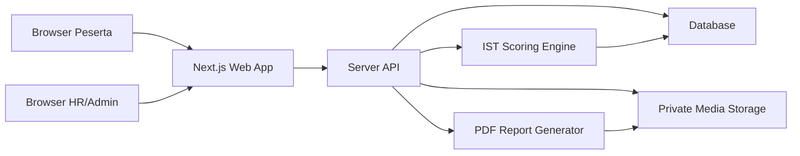
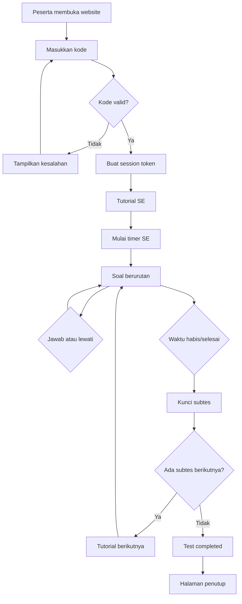

# Development Specification - Production Website IST

## 1. Informasi Dokumen

| Item            | Nilai                          |
| --------------- | ------------------------------ |
| Nama project    | IST Assessment                 |
| Direktori       | `ist`                          |
| Bentuk aplikasi | Website responsif              |
| Framework       | Next.js App Router             |
| Bahasa          | TypeScript                     |
| Tahap saat ini  | Production development         |
| Pengguna utama  | Peserta, HR Admin, Super Admin |
| Status dokumen  | Baseline pengembangan          |

Dokumen ini menjadi acuan utama untuk membangun website produksi pelaksanaan, skoring, dan pelaporan Intelligenz Struktur Test atau IST.

Prototype telah memvalidasi alur pengguna, struktur halaman, aturan timer, navigasi subtes, akses dengan kode peserta, dan bentuk dashboard hasil. Tahap aktif adalah mengganti simulasi dengan layanan produksi yang aman, tervalidasi, auditable, dan siap dioperasikan perusahaan. Bagian prototype dipertahankan sebagai catatan baseline dan regression reference.

---

## 2. Tujuan Product

Website memungkinkan:

1. HR membuat peserta dan sesi tes.
2. Sistem menghasilkan kode akses unik untuk setiap peserta.
3. Peserta mengakses tes tanpa membuat akun.
4. Peserta melihat tutorial sebelum setiap subtes.
5. Peserta mengerjakan soal sesuai urutan dengan timer per subtes.
6. Peserta dapat menjawab atau melewati soal.
7. Sistem berpindah ke subtes berikutnya ketika waktu habis.
8. Sistem menghitung skor berdasarkan kunci dan kelompok usia.
9. HR/Admin melihat hasil, kategori, profil, dan grafik.
10. HR mengunduh laporan setelah hasil berstatus final.

### Baseline prototype yang telah selesai

- Memvalidasi pengalaman peserta dari kode sampai tes selesai.
- Memvalidasi tampilan tutorial teks/video.
- Memvalidasi perilaku timer dan perpindahan subtes.
- Memvalidasi tampilan soal, jawaban, skip, dan review jawaban kosong.
- Memvalidasi struktur dashboard HR/Admin.
- Memvalidasi bentuk grafik hasil seperti workbook Excel.
- Menentukan kebutuhan data dan API sebelum backend produksi dibangun.

### Batasan baseline prototype

- Menghasilkan hasil psikometrik yang digunakan untuk keputusan rekrutmen.
- Menggunakan soal, kunci, norma, atau interpretasi IST produksi.
- Menyimpan data sensitif peserta secara permanen.
- Menyediakan autentikasi HR produksi.
- Menyediakan laporan resmi.
- Menyediakan integrasi ATS/HRIS.
- Menyediakan keputusan otomatis menerima atau menolak kandidat.

---

## 3. Scope IST

| Urutan | Kode | Rentang soal | Jumlah soal | Waktu    |
| ------ | ---- | ------------ | ----------- | -------- |
| 1      | SE   | 1-20         | 20          | 6 menit  |
| 2      | WA   | 21-40        | 20          | 6 menit  |
| 3      | AN   | 41-60        | 20          | 7 menit  |
| 4      | GE   | 61-76        | 16          | 8 menit  |
| 5      | RA   | 77-96        | 20          | 10 menit |
| 6      | ZR   | 97-116       | 20          | 10 menit |
| 7      | FA   | 117-136      | 20          | 7 menit  |
| 8      | WU   | 137-156      | 20          | 9 menit  |
| 9      | ME   | 157-176      | 20          | 9 menit  |

Total waktu kerja subtes adalah 72 menit, tidak termasuk tutorial, perpindahan subtes, pemeriksaan kode, dan halaman penutup.

Urutan subtes bersifat tetap:

`SE -> WA -> AN -> GE -> RA -> ZR -> FA -> WU -> ME`

---

## 4. Role dan Permission

### 4.1 Peserta

Peserta tidak memiliki akun.

Peserta dapat:

- memasukkan kode akses;
- membuka sesi yang terikat dengan kode;
- melihat tutorial setiap subtes;
- memulai subtes;
- menjawab soal;
- melewati soal;
- melihat jumlah soal yang belum dijawab;
- kembali ke soal yang dilewati selama subtes masih aktif;
- menyelesaikan tes;
- melanjutkan sesi setelah koneksi terputus sesuai resume policy.

Peserta tidak dapat:

- melihat kunci atau norma;
- melihat hasil internal HR;
- membuka subtes yang telah selesai;
- mengubah tanggal lahir atau identitas sesi;
- menggunakan kode untuk membuat sesi baru;
- mengulang tes tanpa tindakan HR.

### 4.2 HR Admin

HR Admin dapat:

- login ke dashboard;
- membuat data peserta;
- membuat sesi dan kode akses;
- menyalin, mengirim, membatalkan, atau membuat ulang kode;
- memantau status sesi;
- melihat jawaban yang kosong atau membutuhkan review;
- membuat, mengubah, melihat pratinjau, dan memublikasikan tutorial teks/video per subtes;
- mengarsipkan versi tutorial yang tidak lagi digunakan tanpa mengubah sesi berjalan;
- membuat draft versi subtes, menambahkan soal, dan memperbarui konten soal sesuai permission;
- melihat pratinjau serta mengajukan versi bank soal untuk dipublikasikan;
- memberi skor GE melalui rubrik 0/1/2;
- melihat hasil dan grafik;
- mengubah status hasil sesuai workflow;
- mengunduh laporan final;
- melihat log aktivitas yang relevan.

HR Admin tidak dapat:

- menghapus audit trail;
- mengubah hasil final tanpa proses override dan alasan.

### 4.3 Super Admin

Super Admin dapat:

- mengelola akun HR Admin;
- mengaktifkan atau menonaktifkan user;
- mengatur konfigurasi teknis;
- mengelola tutorial lintas organisasi atau membantu HR Admin sesuai permission;
- mengelola versi subtes dan bank soal lintas organisasi sesuai permission;
- melihat hasil jika memiliki permission `view_results`;
- melihat dan mengekspor audit log;
- mengelola versi master data melalui workflow terpisah.

---

## 5. Technology Stack

### 5.1 Baseline UI yang sudah tersedia

| Lapisan          | Teknologi                                 |
| ---------------- | ----------------------------------------- |
| Framework        | Next.js App Router                        |
| UI               | React                                     |
| Bahasa           | TypeScript                                |
| Styling          | Tailwind CSS dan CSS components           |
| State prototype  | React state/in-memory mock data           |
| Grafik prototype | CSS chart atau React chart component      |
| Testing          | Node test, component test, dan build test |
| Package manager  | npm                                       |

Prototype tidak menggunakan browser storage sebagai sumber kebenaran. Data contoh boleh menggunakan in-memory state karena akan hilang setelah halaman dimuat ulang.

### 5.2 Target produksi

| Lapisan            | Teknologi target                                                  |
| ------------------ | ----------------------------------------------------------------- |
| Web application    | Next.js + React + TypeScript                                      |
| Hosting awal       | Vercel untuk preview, staging, dan production                     |
| Backend            | Next.js Route Handlers atau server actions                        |
| Runtime            | Node.js-compatible runtime                                        |
| Database awal      | Supabase PostgreSQL                                               |
| ORM/migration      | Drizzle ORM                                                       |
| File/video/report  | Supabase Storage dengan private bucket                            |
| Auth HR/Admin awal | Supabase Auth dengan server-side session                          |
| Auth lanjutan      | OIDC/SSO perusahaan melalui provider/adapter                      |
| Auth peserta       | Kode akses + opaque session token yang dikelola aplikasi          |
| Report             | Server-generated PDF                                              |
| Monitoring         | Structured log, error monitoring, platform metrics, dan audit log |

### 5.3 Prinsip arsitektur

- Gunakan modular monolith untuk MVP.
- Pisahkan UI, session engine, scoring engine, dan data access.
- Jangan menaruh kunci, norma, atau rumus rahasia dalam client bundle.
- Browser hanya menampilkan timer; server menjadi sumber waktu.
- Setiap hasil menyimpan versi form, kunci, formula, dan norma.
- Jangan menggunakan Excel sebagai mesin produksi.
- Jangan membuat microservices sebelum ada kebutuhan operasional nyata.

### 5.4 Deployment awal

```text
Browser
  -> Vercel / Next.js
       -> Supabase Auth
       -> Supabase PostgreSQL
       -> Supabase Storage (private)
```

- Vercel menjalankan Next.js UI, Server Components, Route Handlers, dan server actions.
- Supabase PostgreSQL menjadi source of truth untuk user profile, peserta, sesi, respons, tutorial, scoring snapshot, hasil, dan audit event.
- Supabase Auth digunakan untuk HR Admin dan Super Admin. Authorization role/permission tetap diperiksa pada server aplikasi.
- Supabase Storage menggunakan private bucket; akses video tutorial dan PDF diberikan melalui server atau signed URL berumur pendek.
- Kode peserta tidak menggunakan Supabase Auth; aplikasi menerbitkan opaque session token setelah kode tervalidasi.
- Production secrets hanya tersedia pada server dan dikelola melalui environment settings Vercel/Supabase.

### 5.5 Portabilitas ke server kantor

Core domain tidak boleh bergantung langsung pada Vercel atau Supabase. Batas integrasi:

- `DatabaseProvider`: Drizzle + PostgreSQL standar;
- `AuthProvider`: Supabase Auth sekarang, OIDC/SSO perusahaan kemudian;
- `StorageProvider`: Supabase Storage sekarang, S3-compatible/private storage kemudian;
- `MonitoringProvider`: provider cloud sekarang, platform observability perusahaan kemudian.

Business logic tes, timer, scoring, norma, finalisasi, dan audit berada di modul aplikasi. Hindari menaruh core logic pada Supabase Edge Functions, database trigger yang tidak terdokumentasi, atau Vercel-only primitives.

Target server kantor:

```text
Browser
  -> Reverse proxy perusahaan
       -> Next.js Node.js/Docker
            -> PostgreSQL perusahaan
            -> S3-compatible/private storage
            -> OIDC/SSO perusahaan
```

Persyaratan migrasi:

- satu codebase Next.js dapat dijalankan di Vercel maupun sebagai Node.js/Docker;
- schema dan migration dapat dijalankan terhadap PostgreSQL Supabase maupun PostgreSQL kantor;
- environment variables mengganti endpoint, credentials, dan provider tanpa mengubah domain logic;
- calculation snapshot, versi norma/kunci/tutorial, report, dan audit event tetap utuh saat data dimigrasikan;
- cutover wajib melalui staging, backup, restore rehearsal, data reconciliation, security test, dan rollback plan.

---

## 6. Arsitektur Sistem



### Modul utama

1. Participant Access
2. Assessment Session
3. Tutorial Content
4. Test Delivery
5. Timer and Resume
6. Scoring Engine
7. Age Norm Engine
8. GE Manual Scoring
9. Result and Chart
10. HR/Admin Dashboard
11. Report Generator
12. Audit and Security

---

## 7. Route dan Halaman

### 7.1 Public/Participant (baseline UI)

| Route prototype  | Fungsi                  |
| ---------------- | ----------------------- |
| `/`              | Input kode peserta      |
| `/test/tutorial` | Tutorial subtes         |
| `/test/session`  | Halaman pengerjaan soal |
| `/test/complete` | Halaman selesai         |

### 7.2 Route target produksi

| Route                                                      | Fungsi                    |
| ---------------------------------------------------------- | ------------------------- |
| `/test`                                                    | Input kode peserta        |
| `/test/[sessionToken]/tutorial/[subtestCode]`              | Tutorial subtes aktif     |
| `/test/[sessionToken]/question/[subtestCode]/[itemNumber]` | Soal aktif                |
| `/test/[sessionToken]/review/[subtestCode]`                | Review soal yang dilewati |
| `/test/[sessionToken]/transition`                          | Perpindahan antar-subtes  |
| `/test/[sessionToken]/complete`                            | Sesi selesai              |

### 7.3 HR/Admin

| Route                        | Fungsi                          |
| ---------------------------- | ------------------------------- |
| `/hr`                        | Dashboard utama                 |
| `/hr/participants`           | Daftar peserta                  |
| `/hr/participants/new`       | Membuat peserta                 |
| `/hr/sessions`               | Daftar sesi                     |
| `/hr/sessions/new`           | Membuat sesi dan kode           |
| `/hr/sessions/[sessionId]`   | Detail dan status sesi          |
| `/hr/scoring/[sessionId]/ge` | Skoring GE                      |
| `/hr/results/[sessionId]`    | Hasil dan grafik                |
| `/hr/reports/[sessionId]`    | Preview/unduh laporan           |
| `/hr/tutorials`              | Daftar dan versi tutorial       |
| `/hr/tutorials/[tutorialId]` | Edit, preview, publish, archive |
| `/hr/question-bank`          | Daftar versi dan editor soal    |
| `/admin/users`               | Pengelolaan user HR             |
| `/admin/tutorials`           | Pengelolaan tutorial global     |
| `/admin/question-bank`       | Pengelolaan bank soal global    |
| `/admin/audit`               | Audit log                       |

---

## 8. Alur Utama Peserta



### Aturan navigasi

- Satu halaman menampilkan satu soal.
- Soal pertama kali muncul sesuai urutan.
- Tidak ada randomisasi pada prototype.
- Tombol `Jawab & Lanjut` menyimpan jawaban lalu membuka soal berikutnya.
- Tombol `Lewati` menyimpan status `skipped` lalu membuka soal berikutnya.
- Peserta dapat membuka daftar `Belum Dijawab` selama subtes aktif.
- Peserta dapat kembali ke soal yang dilewati selama timer masih berjalan.
- Peserta tidak dapat kembali ke subtes yang sudah ditutup.
- Ketika waktu habis, tidak diperlukan tindakan tambahan dari peserta.

---

## 9. Access Code

### Bentuk kode

Contoh tampilan:

`IST-7K4M9Q2D`

Aturan:

- kode unik per assessment session;
- kode aktif segera setelah HR membuat sesi;
- peserta tidak perlu menunggu approval;
- kode menggunakan karakter yang tidak ambigu;
- kode memiliki masa berlaku;
- kode dapat dibatalkan;
- kode dapat dibuat ulang;
- pembuatan ulang menonaktifkan kode lama;
- kode yang selesai tidak dapat memulai sesi baru;
- satu kode hanya memiliki satu sesi aktif;
- setelah validasi pertama, gunakan session token aman;
- simpan hash kode, bukan kode asli, dalam database produksi;
- batasi percobaan kode salah;
- jangan menulis kode lengkap ke application log.

### Status kode

- `active`
- `in_use`
- `completed`
- `expired`
- `revoked`
- `regenerated`

---

## 10. Tutorial Subtes

Setiap subtes memiliki tutorial sendiri.

Tutorial dapat berupa:

- teks;
- video;
- teks dan video;
- gambar contoh;
- contoh soal non-scored.

Tutorial harus menampilkan:

- nama dan kode subtes;
- deskripsi cara menjawab;
- jumlah soal;
- durasi;
- contoh;
- aturan tombol `Lewati`;
- informasi bahwa timer belum berjalan;
- tombol `Mulai Subtes`.

### Aturan timer tutorial

- waktu tutorial tidak dihitung sebagai waktu subtes;
- video yang buffering tidak mengurangi waktu subtes;
- timer mulai setelah server menerima aksi `start_subtest`;
- tutorial memiliki versi;
- sesi menyimpan versi tutorial yang digunakan;
- perubahan tutorial tidak mengubah sesi yang sedang berjalan.

### Pengelolaan tutorial oleh HR Admin

- HR Admin mengelola tutorial dari route `/hr/tutorials`.
- Super Admin dapat menggunakan `/admin/tutorials` untuk pengelolaan lintas organisasi sesuai permission.
- Tutorial memiliki status `draft`, `published`, dan `archived`.
- Setiap perubahan konten membuat versi baru; versi published tidak diedit langsung.
- HR Admin dapat melihat pratinjau teks dan video sebelum publish.
- Hanya satu versi tutorial per subtes yang aktif untuk sesi baru pada satu waktu.
- Sesi menyimpan `tutorial_version_id` saat dibuat agar perubahan berikutnya tidak memengaruhi sesi berjalan.
- Publish, archive, dan rollback versi tutorial tercatat pada audit log beserta user, waktu, dan alasan.
- Video dan thumbnail disimpan pada private bucket; browser menerima akses terbatas, bukan alamat file publik permanen.
- Tutorial tidak dapat memuat kunci jawaban, norma, atau informasi scoring.

## 10A. Bank Soal dan Versi Subtes

### Permission

- HR Admin dan Super Admin dengan `manage_test_content` dapat membuat draft versi subtes, menambah soal, serta memperbarui soal.
- Permission dibatasi pada organisasi atau ruang lingkup yang ditetapkan.
- Publikasi memerlukan `publish_test_content` dan sign-off pemilik konten/psikolog yang berwenang.
- Pengelolaan kunci, rubrik GE, norma, dan scoring rule menggunakan permission serta workflow terpisah.

### Versioning

- Versi published bersifat immutable.
- Perubahan selalu dimulai dengan menyalin versi published menjadi draft baru.
- Status versi: `draft`, `in_review`, `approved`, `published`, `rejected`, `archived`.
- Sesi baru menyimpan `form_version_id`, `subtest_version_id`, `tutorial_version_id`, `key_version_id`, dan `norm_version_id`.
- Sesi aktif atau selesai tidak berubah ketika versi baru dipublikasikan.
- Rollback berarti mengaktifkan kembali versi lama sebagai versi published; riwayat tidak dihapus.

### Data yang dapat diperbarui

- metadata subtes: judul, durasi, deskripsi, tipe respons utama, dan referensi tutorial;
- item: nomor lokal, urutan, tipe, prompt, opsi, placeholder, serta referensi media privat;
- status item pada draft: `active` atau `inactive`;
- sembilan kode subtes dan urutan `SE -> WA -> AN -> GE -> RA -> ZR -> FA -> WU -> ME` tidak dapat diubah dari editor operasional.

### Validasi draft

- nomor dan urutan item unik serta berkelanjutan;
- jumlah item sesuai metadata draft;
- tipe respons item kompatibel dengan subtes;
- soal pilihan memiliki opsi yang lengkap dan unik;
- media tersedia di private Storage dan lolos pemeriksaan akses;
- tidak ada prompt kosong, item duplikat, atau referensi aset rusak;
- durasi dan perubahan jumlah item ditandai sebagai perubahan material yang memerlukan review;
- kunci atau norma tidak disimpan di payload editor konten soal.

### Audit

Catat actor, organisasi, versi asal, versi draft, alasan perubahan, diff metadata, item yang ditambah/diubah/dinonaktifkan, status review, approver, waktu publish, dan rollback.

---

## 11. Timer dan Resume

### Sumber waktu

Server menjadi sumber kebenaran.

Saat subtes dimulai, server menyimpan:

- `started_at`;
- `duration_seconds`;
- `expires_at`.

Browser menghitung tampilan berdasarkan `expires_at`, bukan menurunkan angka secara mandiri sebagai sumber kebenaran.

Formula tampilan:

```
remaining_seconds = max(0, expires_at - server_now)
```

### Saat waktu habis

1. Server menolak perubahan jawaban setelah `expires_at`.
2. Client melakukan autosave terakhir jika masih valid.
3. Subtest attempt berubah menjadi `completed_timeout`.
4. Jawaban kosong tetap `unanswered`.
5. Sistem membuka tutorial subtes berikutnya.
6. Timer berikutnya belum berjalan sampai peserta menekan `Mulai Subtes`.

### Refresh dan reconnect

- Refresh tidak mengulang timer.
- Membuka tab baru tidak membuat timer baru.
- Koneksi terputus tidak menghentikan timer.
- Setelah reconnect, client meminta state sesi terbaru.
- Jika waktu sudah habis, client diarahkan ke transition/tutorial berikutnya.
- Hanya satu active attempt per subtes per sesi.

---

## 12. Model Respons

### Status respons

- `unanswered`
- `answered`
- `skipped`
- `changed`
- `locked`

### Jenis respons

| Subtes | Jenis data                          |
| ------ | ----------------------------------- |
| SE     | option id                           |
| WA     | option id                           |
| AN     | option id                           |
| GE     | text response + manual rubric score |
| RA     | numeric/text numeric response       |
| ZR     | numeric/text numeric response       |
| FA     | option id/image option id           |
| WU     | option id/image option id           |
| ME     | option id                           |

Setiap respons menyimpan:

- session id;
- subtest version id;
- item version id;
- response value;
- status;
- answered at;
- last changed at;
- source device/session;
- locked at.

---

## 13. State Machine Sesi

```
code_generated
-> code_validated
-> tutorial
-> subtest_in_progress
-> subtest_completed
-> tutorial_next
-> test_completed
-> needs_ge_scoring
-> calculated
-> reviewed (optional)
-> final
```

Status exception:

- `paused_by_admin`
- `expired`
- `cancelled`
- `invalidated`
- `needs_review`
- `void`

### Aturan status

- Hanya server yang boleh mengubah status authoritative.
- Transisi harus tervalidasi.
- Setiap perubahan status masuk audit log.
- Hasil belum dapat diekspor sebelum `final`.
- Peserta tidak melihat status scoring internal.

---

## 14. Scoring Engine

Scoring engine harus menjadi modul backend terpisah dari UI.

### Input

- assessment session;
- form version;
- response list;
- scoring key version;
- scoring rule version;
- norm version;
- tanggal lahir;
- tanggal mulai tes;
- skor GE dari HR.

### Pipeline

```
Validate session and versions
-> Validate responses
-> Score objective items
-> Wait/validate GE score
-> Calculate RW per subtest
-> Determine exact age
-> Select age norm band
-> Convert RW to SW/WS
-> Calculate total/WS
-> Convert total to IQ
-> Determine category
-> Calculate dominance/profile
-> Save reproducible result
```

### Skor objektif

- jawaban benar: 1;
- jawaban salah: 0;
- skipped/unanswered: 0;
- jangan menggunakan approximate lookup untuk kunci pilihan ganda;
- variasi jawaban angka harus ditentukan secara eksplisit pada scoring rules.

### Skor GE

- HR memilih skor 0, 1, atau 2 berdasarkan rubrik terkunci;
- jawaban peserta tetap disimpan;
- skor menyimpan scorer dan timestamp;
- override membutuhkan alasan;
- hasil tidak final sebelum seluruh GE memiliki skor;
- prototype hanya mensimulasikan workflow ini.

### Versioning

Setiap result menyimpan:

- `assessment_form_version`;
- `scoring_key_version`;
- `scoring_rule_version`;
- `norm_version`;
- `tutorial_version`;
- `calculation_engine_version`.

---

## 15. Logic Umur dan Norma

Umur dihitung berdasarkan tanggal lahir dan tanggal mulai tes.

Pseudocode:

```tsx
let age = testDate.year - birthDate.year;

if (
  testDate.month < birthDate.month ||
  (testDate.month === birthDate.month && testDate.day < birthDate.day)
) {
  age -= 1;
}
```

Jangan menggunakan:

```
YEAR(test_date) - YEAR(birth_date)
```

karena dapat menghasilkan usia satu tahun lebih besar sebelum ulang tahun peserta.

### Norm lookup

```
norm_band = age >= min_age AND age <= max_age
standard_score = lookup(norm_version, norm_band, subtest, raw_score)
```

Aturan:

- kelompok usia harus berasal dari norm version yang disahkan;
- hasil menyimpan age at test dan norm band;
- raw score yang sama dapat menghasilkan standard score berbeda berdasarkan usia;
- jika tidak ada norm band, status menjadi `needs_review`;
- jangan memakai closest/approximate band secara otomatis;
- perubahan norma membuat versi baru, bukan menimpa hasil lama.

---

## 16. Hasil dan Grafik

Dashboard hasil menampilkan:

- identitas peserta;
- nomor sesi;
- tanggal lahir;
- tanggal tes;
- usia saat tes;
- tujuan tes;
- status;
- jumlah answered/skipped/unanswered;
- durasi setiap subtes;
- RW setiap subtes;
- SW/WS setiap subtes;
- kategori setiap subtes;
- total;
- IQ jika formula telah disahkan;
- kategori IQ;
- dominasi/profil;
- grafik sembilan subtes;
- versi form/norma;
- catatan review;
- status laporan.

### Grafik utama

- sumbu X: `SE, WA, AN, GE, ME, RA, ZR, FA, WU`;
- sumbu Y: standard score;
- nilai ditampilkan pada tooltip atau label;
- grafik harus sesuai dengan angka di tabel;
- jangan menghitung ulang data di client;
- grafik menerima data hasil dari backend.

### Akses hasil

- HR Admin dapat melihat hasil peserta dalam organisasinya.
- Super Admin hanya dapat melihat jika memiliki `view_results`.
- Peserta tidak melihat hasil pada MVP.
- Result final tidak dapat diedit langsung.

---

## 17. Data Model

### 17.1 User dan organisasi

`organizations`: id, name, status, created_at

`users`: id, organization_id, email, display_name, role, status, last_login_at, created_at

### 17.2 Peserta dan sesi

`candidates`: id, organization_id, external_reference, full_name, birth_date, gender (optional), education (optional), test_purpose, created_by, created_at

`assessment_sessions`: id, candidate_id, form_version_id, status, scheduled_at, started_at, completed_at, age_at_test, current_subtest_code, created_by, created_at

`access_codes`: id, session_id, code_hash, status, expires_at, failed_attempts, last_used_at, revoked_at, regenerated_from_id, created_at

### 17.3 Master tes

`assessment_form_versions`: id, form_code, version, title, status, effective_date, approved_by, checksum

`subtest_versions`: id, form_version_id, code, sequence, title, duration_seconds, item_count

`item_versions`: id, subtest_version_id, item_number, item_type, content_reference, sequence, status

`item_options`: id, item_version_id, option_code, content_reference, sequence

`tutorial_versions`: id, subtest_version_id, version, text_content, video_reference, status, effective_date

### 17.4 Attempt dan respons

`subtest_attempts`: id, session_id, subtest_version_id, status, started_at, expires_at, completed_at, completion_reason

`responses`: id, session_id, subtest_attempt_id, item_version_id, response_value, response_status, answered_at, updated_at, locked_at

### 17.5 Skoring dan hasil

`scoring_key_versions`: id, form_version_id, version, status, effective_date, approved_by, checksum

`item_scoring_rules`: id, scoring_key_version_id, item_version_id, rule_type, rule_payload_encrypted, max_score

`norm_set_versions`: id, form_version_id, version, population_reference, status, effective_date, approved_by, checksum

`norm_age_bands`: id, norm_set_version_id, label, min_age, max_age

`norm_score_rows`: id, norm_age_band_id, subtest_code, raw_score, standard_score

`item_scores`: id, response_id, score, scoring_rule_version, scored_by, scored_at, override_reason

`subtest_scores`: id, session_id, subtest_code, raw_score, standard_score, category, norm_age_band_id

`assessment_results`: id, session_id, status, age_at_test, total_raw_score, total_standard_score, iq_score, iq_category, dominance, profile, form_version, scoring_key_version, norm_version, engine_version, calculated_at, finalized_at

### 17.6 Audit dan laporan

`reports`: id, result_id, report_version, storage_reference, file_hash, generated_by, generated_at

`audit_logs`: id, organization_id, actor_id, action, object_type, object_id, metadata_reference, created_at

---

## 18. API Contract Target

### Participant access

`POST /api/access-codes/validate`

Request:

```json
{
  "code": "IST-7K4M9Q2D"
}
```

Response:

```json
{
  "sessionToken": "opaque-token",
  "sessionStatus": "code_validated",
  "nextRoute": "/test/opaque-token/tutorial/SE"
}
```

### Session

- `GET /api/sessions/:token/state`
- `POST /api/sessions/:token/subtests/:code/start`
- `POST /api/sessions/:token/subtests/:code/complete`
- `POST /api/sessions/:token/heartbeat`
- `POST /api/sessions/:token/finish`

### Responses

- `PUT /api/sessions/:token/responses/:itemId`
- `POST /api/sessions/:token/responses/:itemId/skip`
- `GET /api/sessions/:token/subtests/:code/unanswered`

Request jawaban:

```json
{
  "value": "option-id",
  "clientTimestamp": "2026-07-13T08:00:00.000Z"
}
```

Server harus memvalidasi session, subtest attempt, item, dan `expires_at` sebelum menyimpan.

### HR/Admin

- `POST /api/hr/candidates`
- `POST /api/hr/sessions`
- `POST /api/hr/sessions/:id/access-code/regenerate`
- `POST /api/hr/sessions/:id/access-code/revoke`
- `GET /api/hr/sessions`
- `GET /api/hr/sessions/:id`
- `PUT /api/hr/sessions/:id/ge-scores`
- `POST /api/hr/sessions/:id/calculate`
- `POST /api/hr/results/:id/finalize`
- `GET /api/hr/results/:id`
- `POST /api/hr/results/:id/report`
- `GET /api/hr/tutorials`
- `POST /api/hr/tutorials`
- `PUT /api/hr/tutorials/:id`
- `POST /api/hr/tutorials/:id/publish`
- `POST /api/hr/tutorials/:id/archive`

### Response error standard

```json
{
  "error": {
    "code": "SESSION_EXPIRED",
    "message": "Sesi tidak lagi aktif.",
    "requestId": "request-id"
  }
}
```

---

## 19. Security Requirements

- HR/Admin menggunakan authentication terkelola.
- Authorization divalidasi server-side.
- Peserta menggunakan kode hanya untuk memperoleh opaque session token.
- Session token tidak mengandung PII, kunci, atau skor.
- Access code disimpan dalam bentuk hash.
- Batasi percobaan validasi kode.
- Gunakan HTTPS pada produksi.
- Materi, video, laporan, dan aset soal disimpan privat.
- Kunci/norma tidak boleh dikirim ke browser peserta.
- Jangan menyimpan kunci di source code frontend.
- Hindari PII, kode akses, jawaban, atau kunci pada log umum.
- Gunakan audit log untuk melihat, mengubah, menilai, finalisasi, unduh, dan re-score.
- Pisahkan permission data peserta, hasil, dan konfigurasi master.
- Gunakan Content Security Policy.
- Lindungi mutation API dari CSRF sesuai model autentikasi.
- Validasi seluruh input dengan schema validation.
- Gunakan database transaction untuk finalisasi hasil.
- Report final memiliki hash dan versi.
- Backup dan recovery diuji sebelum produksi.

---

## 20. UI/UX Requirements

### Participant

- Fokus pada satu tindakan utama.
- Tidak menampilkan sidebar atau dashboard.
- Teks timer mudah terlihat tetapi tidak mengganggu.
- Tombol jawaban memiliki target sentuh yang cukup besar.
- Status autosave terlihat.
- Tombol skip berbeda dari tombol submit.
- Tampilkan progres soal dan subtes.
- Hindari dialog konfirmasi saat timer habis.
- Mendukung keyboard untuk memilih jawaban dan lanjut.
- Responsive untuk laptop dan tablet.
- Mobile boleh didukung untuk prototype, tetapi device policy produksi harus diputuskan.

### HR/Admin

- Dashboard menampilkan item yang membutuhkan tindakan.
- Tombol pembuatan sesi mudah ditemukan.
- Kode dapat disalin tanpa membuka detail sensitif lain.
- Status sesi menggunakan label yang konsisten.
- Hasil angka dan grafik harus saling cocok.
- Skoring GE menampilkan rubrik secara jelas.
- Pengelolaan tutorial menyediakan draft, preview, publish, archive, serta riwayat versi.
- Override selalu meminta alasan.
- Master kunci/norma tidak tampil pada halaman operasional.

### Accessibility

- Struktur heading berurutan.
- Semua control memiliki label.
- Tidak mengandalkan warna saja.
- Focus state terlihat.
- Kontras teks memenuhi kebutuhan aksesibilitas.
- Tutorial video menyediakan caption/transcript pada produksi.
- Timer memiliki label yang dapat dibaca assistive technology tanpa mengumumkan setiap detik.

---

## 21. Baseline Screens

### Screen P1 - Access Code

brand/title; deskripsi singkat; input kode; tombol verifikasi; error invalid/expired/completed; link bantuan.

### Screen P2 - Tutorial

progress subtes; judul subtes; jumlah soal dan durasi; teks/video; aturan skip; status timer belum dimulai; tombol mulai.

### Screen P3 - Test Session

subtes aktif; nomor soal; timer; progress bar; konten soal placeholder; opsi jawaban; tombol skip; tombol jawab dan lanjut; tombol/daftar belum dijawab; status autosave.

### Screen P4 - Transition

subtes selesai; jawaban tersimpan; tidak dapat kembali; tombol atau redirect ke tutorial berikutnya.

### Screen P5 - Test Complete

informasi seluruh sesi telah selesai; peserta dapat menutup halaman; tidak menampilkan hasil.

### Screen H1 - Dashboard

metric card; jumlah sesi; sesi berlangsung; menunggu GE; final; sesi terbaru; tombol buat sesi.

### Screen H2 - Session Detail

identitas; kode dan status; progres subtes; answered/skipped/unanswered; durasi; insiden; tindakan revoke/regenerate/pause/void.

### Screen H3 - GE Scoring

butir 61-76; jawaban peserta; rubrik 0/1/2; pilihan skor; catatan/override; simpan dan calculate.

### Screen H4 - Result

identitas; usia/norm band; tabel RW/SW; kategori; IQ; dominance/profile; grafik; versi norma; tombol finalisasi/unduh.

---

## 22. Baseline Data

Gunakan data fiktif.

Contoh:

```tsx
const demoParticipant = {
  id: "P-0241",
  name: "Nadia Pratama",
  birthDate: "2000-05-14",
  testDate: "2026-07-13",
  purpose: "Rekrutmen",
};
```

Aturan data prototype:

- jangan gunakan data peserta nyata;
- jangan menyalin kunci ke client;
- gunakan teks soal placeholder;
- grafik menggunakan angka demo;
- setiap screen diberi label prototype bila dapat disalahartikan sebagai hasil resmi;
- data boleh hilang saat refresh.

---

## 23. Implementation Phases

Roadmap lengkap, hasil, dan exit gate setiap fase berada pada §21 `DEVELOPMENT_BRIEF.md`. Urutan implementasi yang berlaku adalah:

1. **Product dan governance lock:** lisensi, psikolog owner, scoring source, privacy, dan scope disahkan.
2. **Production foundation:** environment, PostgreSQL, migrations, auth, authorization, storage, audit, monitoring, dan CI/CD.
3. **Participant session engine:** access code, token, state machine, timer server-side, autosave, resume, locking, dan sembilan subtes.
4. **HR operations:** participant registry, session lifecycle, code management, monitoring, dan permission.
5. **Scoring dan norm engine:** master data versioned, GE review, age norm, golden dataset, dan reproducible result.
6. **Result dan reporting:** workflow review/final, chart, PDF versioned, download authorization, dan override audit.
7. **Security, privacy, dan reliability:** threat model, security test, accessibility, load, backup/restore, retention, serta incident response.
8. **UAT dan parallel run:** validasi stakeholder dan perbandingan terhadap perhitungan resmi.
9. **Limited pilot:** penggunaan kelompok terbatas dengan monitoring dan support aktif.
10. **Production go-live:** readiness review, migration, smoke test, rollback, runbook, dan sign-off.
11. **Continuous improvement:** security patch, access review, regression scoring, capacity, dan fitur pasca-rilis.

---

## 24. Baseline UI Acceptance Criteria

### Access code

- input kode dapat digunakan untuk membuka tutorial demo;
- invalid state dapat ditampilkan;
- peserta tidak perlu akun;
- halaman menunjukkan bahwa kode hanya untuk satu sesi.

### Tutorial

- setiap subtes dapat memiliki teks/video berbeda;
- timer belum berjalan;
- jumlah soal dan durasi terlihat;
- tombol mulai membuka test session.

### Test session

- satu soal per halaman;
- soal muncul berurutan;
- peserta dapat memilih jawaban;
- peserta dapat skip;
- jumlah skipped terlihat;
- peserta dapat kembali ke skipped selama aktif;
- timer terlihat dan berjalan;
- status autosave terlihat;
- selesai membuka transition/complete.

### HR/Admin

- dashboard dapat dibuka;
- daftar sesi terlihat;
- tombol generate code menghasilkan kode demo baru;
- status sesi terlihat;
- grafik sembilan subtes terlihat;
- hasil demo menampilkan IQ, kategori, dan dominance;
- terdapat label bahwa data bukan hasil resmi.

### Technical

- production build berhasil;
- route utama dapat server-render;
- tidak ada starter loading skeleton;
- layout responsif;
- tidak ada soal/kunci produksi dalam source client;
- tidak ada database produksi yang dibuat pada tahap prototype.

---

## 25. Production Acceptance Criteria

### Timer

- refresh tidak menambah waktu;
- reconnect tidak mengulang subtes;
- server menolak jawaban setelah expires_at;
- timeout menutup subtes satu kali;
- tidak ada dua attempt aktif untuk subtes yang sama.

### Scoring

- seluruh hasil cocok dengan golden dataset;
- boundary usia teruji;
- min/max raw score teruji;
- kategori threshold teruji;
- seluruh GE memiliki skor sebelum final;
- result dapat direproduksi dari version identifiers;
- tidak ada formula error atau approximate lookup yang tidak diinginkan.

### Security

- kode brute force dibatasi;
- participant token tidak dapat membuka sesi lain;
- peserta tidak dapat mengakses HR route;
- HR tidak dapat mengakses organisasi lain;
- kunci/norma tidak muncul di response peserta;
- report hanya dapat diunduh oleh user berwenang;
- setiap perubahan skor dan finalisasi tercatat.

---

## 26. Testing Strategy

### Unit test

age calculation; age band selection; access code status; state transition; timer expiration; objective item scoring; GE completeness; category threshold; dominance/profile formula.

### Integration test

code validate -> tutorial; start subtest -> response save; skip -> unanswered list; timeout -> next tutorial; test complete -> needs GE; GE complete -> calculate; calculate -> result; result -> final report.

### End-to-end test

peserta menyelesaikan sembilan subtes; peserta refresh saat timer; peserta reconnect setelah timeout; HR membuat dan mencabut kode; HR menilai GE; HR melihat hasil dan grafik; HR mengunduh laporan final.

### Golden dataset

Siapkan minimum 30-50 kasus anonim yang mencakup: semua kelompok usia; ulang tahun tepat pada tanggal tes; sehari sebelum dan sesudah ulang tahun; raw score minimum/maksimum; setiap batas kategori; jawaban kosong; sesi timeout; GE 0/1/2; re-score dengan version berbeda.

---

## 27. Known Risks dan Blockers

### 27.1 Kunci tidak konsisten

Terdapat perbedaan kunci antar-sheet pada file sumber. Tidak boleh memilih salah satu secara otomatis. Dibutuhkan satu sumber resmi dan sign-off sebelum scoring engine produksi.

### 27.2 Norma usia tidak konsisten

Kelompok usia pada workbook kunci dan aplikasi Excel tidak sepenuhnya sama. Norma harus direkonsiliasi dan dibuat versioned master data.

### 27.3 Formula usia lama

Formula Excel menggunakan selisih tahun sehingga dapat salah sebelum ulang tahun. Sistem baru wajib menghitung usia lengkap.

### 27.4 Interpretasi dan formula error

Workbook lama memiliki error dan sebagian interpretasi manual. Jangan memindahkan formula tanpa validasi.

### 27.5 Skoring GE

GE membutuhkan judgment terhadap jawaban. Prototype hanya menggambarkan workflow; aturan final harus disahkan.

### 27.6 Lisensi dan kerahasiaan

Pastikan hak penggunaan, digitalisasi, penyimpanan, dan penyajian materi. Jangan menaruh materi rahasia pada repository publik.

### 27.7 Hasil untuk rekrutmen

Sistem tidak melakukan keputusan otomatis menerima atau menolak kandidat. Hasil IST menjadi salah satu informasi dalam proses perusahaan.

---

## 28. Environment Variables Target

Target Vercel + Supabase membutuhkan:

```
APP_BASE_URL=
DATABASE_URL=
NEXT_PUBLIC_SUPABASE_URL=
NEXT_PUBLIC_SUPABASE_PUBLISHABLE_KEY=
SUPABASE_SECRET_KEY=
SUPABASE_MEDIA_BUCKET=
SUPABASE_REPORT_BUCKET=
SESSION_TOKEN_SECRET=
ACCESS_CODE_PEPPER=
ERROR_MONITORING_DSN=
```

Aturan:

- jangan commit `.env`; sediakan `.env.example` tanpa nilai rahasia;
- hanya variable berawalan `NEXT_PUBLIC_` yang boleh masuk browser bundle;
- `SUPABASE_SECRET_KEY`, `DATABASE_URL`, token secret, dan pepper hanya boleh digunakan pada server;
- gunakan environment settings Vercel/Supabase dan pisahkan development, preview/staging, serta production;
- saat migrasi ke server kantor, ganti nilai provider melalui environment tanpa mengubah domain logic.

---

## 29. Local Development

Persyaratan: Node.js sesuai `package.json`; npm; environment lokal.

Perintah utama:

```bash
npm install
npm run dev
npm run build
npm test
```

Prototype harus dapat dijalankan tanpa database produksi.

---

## 30. Definition of Done - Baseline UI

Baseline UI dinyatakan selesai jika:

- halaman kode peserta tersedia;
- tutorial tersedia;
- test session interaktif tersedia;
- answer dan skip bekerja;
- timer UI bekerja;
- transition/complete tersedia;
- dashboard HR/Admin tersedia;
- generate code simulation tersedia;
- hasil dan grafik demo tersedia;
- seluruh halaman responsif;
- data yang digunakan fiktif;
- build dan test berhasil;
- stakeholder menyetujui flow dan layout;
- seluruh perubahan lanjutan dicatat untuk phase produksi.

---

## 31. Definition of Done - Production Release

Production release dinyatakan selesai jika:

- authentication dan authorization berfungsi;
- database dan migration tervalidasi;
- access code aman dan auditable;
- session/timer server-side berfungsi;
- autosave/reconnect berfungsi;
- soal dan aset dimuat secara aman;
- scoring engine lulus golden test;
- age norm lulus boundary test;
- GE scoring berfungsi;
- result dan grafik konsisten;
- laporan final terkunci;
- audit log lengkap;
- security test selesai;
- hak penggunaan materi telah dikonfirmasi;
- UAT, parallel run, dan pilot disetujui;
- monitoring, alert, backup, restore, rollback, SOP, dan support owner aktif;
- product owner, psikolog, HR, security/compliance, dan engineering memberikan sign-off go-live.

---

## 32. Keputusan yang Masih Terbuka

1. Apakah nama direktori final tetap `ist`?
2. Apakah tutorial video wajib selesai sebelum tombol mulai aktif?
3. Apakah mobile didukung resmi atau hanya desktop/tablet?
4. Siapa yang mengesahkan kunci, rubrik GE, norma, kategori, dan interpretasi?
5. Bagaimana isi dan format laporan final?
6. Metode login awal Supabase Auth menggunakan email/password, magic link, atau SSO?
7. Region dan paket Vercel/Supabase, provider monitoring, dan layanan email apa yang digunakan?
8. Apakah sistem single-company atau multi-tenant?
9. Berapa lama data peserta, respons, hasil, audit, dan report disimpan?
10. Apa target availability, concurrency, browser minimum, dan support response?
11. Apakah hasil perlu diintegrasikan ke ATS/HRIS setelah go-live?
12. Kapan target migrasi ke server kantor dan infrastruktur apa yang tersedia di sana?

---

## 33. Catatan Implementasi

- Jangan memasukkan konten soal produksi sebelum ada persetujuan hak penggunaan.
- Gunakan placeholder sampai hak penggunaan materi produksi dan akses repository disetujui.
- Bangun scoring engine setelah rekonsiliasi kunci/norma.
- Pisahkan feature modules agar database atau deployment dapat diganti tanpa menulis ulang UI.
- Hindari overengineering, tetapi jangan mengurangi kebutuhan keamanan, audit, dan reliability produksi.
- Pertahankan aksesibilitas, responsive behavior, dan auditability sejak awal.
- Setiap perubahan requirement harus memperbarui dokumen ini.

Ringkasan padat requirement tersedia di `DEVELOPMENT_BRIEF.md` pada direktori yang sama.
